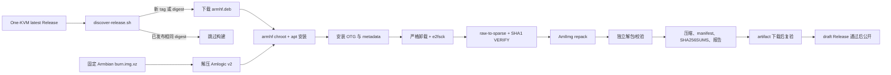

# 架构与稳定性边界

## 目标

仓库把一个已经在 OneCloud/WS1608 上启动验证过的 Amlogic 直刷包，转换成带 One-KVM Rust 的新直刷包。启动链、内核、设备树、HDMI 配置和 Amlogic 容器结构保持来自固定基础资产；自动变化的主要内容是 rootfs 内的 One-KVM 包、WS1608 OTG 配置和可追溯的构建 metadata。

## 稳定通道决策

稳定通道不追踪 Armbian 的每日构建、内核、U-Boot 或设备树。原因是 WS1608 的启动可靠性依赖这几部分的组合，云端可以检查文件结构，却不能证明新内核在实体板卡上能启动和显示。

当前稳定通道的变化范围：

- 上游 `mofeng-git/One-KVM` 的最新非 draft、非 prerelease Release。
- Release 中唯一匹配 `one-kvm_*_armhf.deb` 的包。
- rootfs 内的 Debian 依赖、One-KVM systemd 单元和 WS1608 OTG 集成文件。

不在稳定通道自动变化的内容：

- Amlogic DDR、USB U-Boot、bootloader。
- `boot` 分区、内核、initrd、DTB、resource 和 HDMI 参数。
- 基础 rootfs 的 Debian/Armbian 包集合。

需要更新基础层时，先按 [hardware-validation.md](hardware-validation.md) 做候选包实机测试，再更新 `config/base.env`，不能直接把每周检查改成滚动内核构建。

## 数据流

## 输入与输出

| 输入或输出 | 位置/规则 |
| --- | --- |
| 基础压缩包 | `config/base.env` 的 `BASE_IMAGE_URL` 和 `BASE_IMAGE_SHA256` |
| Amlogic 工具 | `scripts/build-tools.sh` 从 `config/tool-versions.env` 固定提交构建 AmlImg |
| One-KVM 包 | 上游 Release API 返回的唯一 `armhf.deb` |
| 工作目录 | GitHub runner 的 `$RUNNER_TEMP/ws1608-work` |
| 未压缩成品 | `One-KVM_<version>-<upstream-tag>-bRRRAAA_<flavor>.burn.img` |
| 压缩成品 | 同名加 `.xz` |
| 构建摘要 | `manifest.json`，包含基础/上游摘要、版本、序号、builder 和全部文件摘要 |
| 验证报告 | `validation-report.json`，记录 CI 检查通过且 `hardware_boot_tested=false` |
| 校验和 | `SHA256SUMS`，只使用文件名，覆盖 raw、xz、manifest 和报告 |

## Amlogic 容器布局

稳定基础包和成品都必须有以下 12 行，顺序不能改变；`config/commands.expected` 是检查基准。

| ID | 类型 | 名称 | 图像类型 |
| ---: | --- | --- | --- |
| 0 | `USB` | `DDR` | normal |
| 1 | `USB` | `UBOOT_COMP` | normal |
| 2 | `ini` | `aml_sdc_burn` | normal |
| 3 | `PARTITION` | `boot` | sparse |
| 4 | `VERIFY` | `boot` | normal |
| 5 | `PARTITION` | `bootloader` | normal |
| 6 | `VERIFY` | `bootloader` | normal |
| 7 | `conf` | `platform` | normal |
| 8 | `PARTITION` | `resource` | normal |
| 9 | `VERIFY` | `resource` | normal |
| 10 | `PARTITION` | `rootfs` | sparse |
| 11 | `VERIFY` | `rootfs` | normal |

Amlogic v2 的头部是无填充的二进制布局，`itemCount` 位于偏移 24；不要按 C 结构体默认对齐读取。容器 CRC 不是普通文件的 SHA-256，AmlImg 解包会检查它，`scripts/lib/image-format.mjs` 也有独立的 CRC 测试。

## rootfs 修改内容

构建只修改 rootfs，不重新生成 boot 分区：

- 安装官方 `one-kvm` `armhf.deb` 和 apt 解析出的 `libdrm2`、`libdrm-common` 等依赖。
- 让 `one-kvm.service` 在 `multi-user.target` 下启用。
- 安装 `/usr/lib/systemd/system/one-kvm-otg.service`。
- 安装 `/etc/systemd/system/one-kvm.service.d/otg.conf`，通过 `Wants=` 和 `After=` 让 One-KVM 启动前先尝试 OTG。
- 安装 `/etc/modules-load.d/one-kvm.conf`，内容为 `libcomposite`。
- 安装 `/usr/sbin/one-kvm-enable-otg`，在 `/sys/devices/platform/soc/c9040000.usb/usb_role/*/role` 出现后将角色设为 `device`，最多重试 30 秒。
- 写入 `/etc/ws1608-one-kvm-release`，便于实机识别构建来源。
- metadata 同时记录 One-KVM Deb 摘要、上游 tag、构建 tag/序号和 builder commit。

版本文件同时包含 `build_tag` 和 `build_number`。`verify-image.sh` 要求这些值与工作流身份一致，并检查 One-KVM 的 Deb 状态、运行库、ARM 动态加载器、service symlink、`ExecStart`、`User` 以及 OTG 文件内容。

OTG unit 有 `WantedBy=multi-user.target`，但当前设计不依赖单独的 wants symlink；One-KVM drop-in 的 `Wants=` 已经提供依赖关系。不要为了“看起来启用”再次添加第二个链接。

## 稳定性和可复现性

镜像结构是可复现的，但当前构建不是严格字节级可复现：rootfs 安装会访问当天的 Debian/Armbian 仓库，ext4 时间戳、apt 元数据和 `built_at` 可能变化。同一 One-KVM 输入使用 `force=true` 重建，成品 SHA-256 可能不同；每次构建都有新的 `bRRRAAA` tag，manifest 和上游/基础摘要仍能追溯来源。

如果将来需要字节级复现，应使用 Debian snapshot、固定依赖版本、固定构建时间和可控 ext4 元数据。当前 Release 通过内容校验和、完整结构检查和独立 artifact 复验保证可验证性，而不是宣称二次构建得到相同字节。

## 非目标

- GitHub hosted runner 不连接 USB Burning Tool，也不能模拟 HDMI、USB 视频采集或 HID。
- CI 不能证明某一成品已经在实体 WS1608 启动。
- 仓库不保存设备密码、局域网地址或物理测试机凭据。
