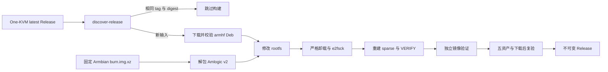
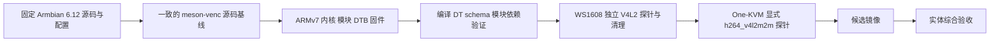

# 架构与稳定性边界

## 目标

仓库有两条严格隔离的工作链：

1. 稳定链把固定 Armbian Amlogic 直刷包转换为带最新 One-KVM Rust 的新包；
2. 候选链在相同 Armbian/Linux 6.12 系统上研究 Meson8b HCODEC V4L2 M2M。

稳定链已经实现。HCODEC 候选链已形成可复验的 ARMv7 内核、模块、DTB、固件
和独立工具 artifact，并在 WS1608 生成有效单帧码流；因 `STREAMOFF` 清理阻塞，
目前仍不是可发布候选。

## 稳定系统

稳定系统固定使用：

- `base-20260804-consolefix`；
- Armbian `26.8.0-trunk.413` / Debian Trixie；
- Linux `6.12.28-current-meson`；
- 已验证的 OneCloud DDR、U-Boot、bootloader、DTB、HDMI、网络和 eMMC；
- One-KVM systemd 与 WS1608 OTG 配置。

每周任务只更新上游 One-KVM armhf Deb 及 rootfs 依赖。boot、内核、DTB、
U-Boot、resource 和基础包集合不自动变化。


```mermaid
flowchart LR
  A[One-KVM latest Release] --> B[discover-release]
  B -->|相同 tag 与 digest| S[跳过构建]
  B -->|新输入| C[下载并校验 armhf Deb]
  D[固定 Armbian burn.img.xz] --> E[解包 Amlogic v2]
  C --> F[修改 rootfs]
  E --> F
  F --> G[严格卸载与 e2fsck]
  G --> H[重建 sparse 与 VERIFY]
  H --> I[独立镜像验证]
  I --> J[五资产与下载后复验]
  J --> K[不可变 Release]
```

## HCODEC 候选

唯一候选路线由 [ADR-0003](adr/0003-armbian-6.12-hcodec-route.md) 定义：


```mermaid
flowchart LR
  A[固定 Armbian 6.12 源码与配置] --> B[一致的 meson-venc 源码基线]
  B --> C[ARMv7 内核 模块 DTB 固件]
  C --> D[编译 DT schema 模块依赖验证]
  D --> E[WS1608 独立 V4L2 探针与清理]
  E --> F[One-KVM 显式 h264_v4l2m2m 探针]
  F --> G[候选镜像]
  G --> H[实体综合验收]
```

候选链必须复用稳定系统的用户空间、USB Gadget/OTG 和 One-KVM 软件编码
能力。它只替换候选内核、模块、DTB 与固件，不得覆盖稳定基础或 Release。

### 内核接口

目标驱动是 `meson-venc`：

- V4L2 memory-to-memory；
- NV12/YUYV 输入；
- Annex-B H.264 输出；
- Meson8b HCODEC、Canvas、DMA/CMA、固件与 mailbox IRQ；
- 单编码实例；
- One-KVM `h264_v4l2m2m` 后端。

资料中的 AArch64 6.12.98 模块只证明其他平台构建结果，不能作为 ARMv7
6.12.28 产物。18 个补丁和最终源码存在分叉，实施前必须选定一个可复现
基线并补齐 Meson8b 时钟、HHI、OneCloud DT 和固件。

### 状态边界

稳定基础已有实体启动证据。任何加入新内核或 DTB 的 HCODEC 候选都重新从：

```text
hardware_boot_tested=false
hardware_encoder_tested=false
```

开始。CI 通过不改变这两个值；只有对应实体测试可以改变。

## Amlogic 容器边界

稳定基础和成品必须保持 `config/commands.expected` 定义的 12 个条目，包括
DDR、U-Boot、boot、bootloader、resource、rootfs 及其 VERIFY。稳定构建只
改变 rootfs；HCODEC 候选若改变 boot 或 DTB，必须作为独立 prerelease，并
逐字节证明其余条目不变。

Amlogic v2 CRC、item table、Android sparse 和分区 SHA-1 VERIFY 都需要独立
验证，不能只检查外层 SHA-256。

## 非目标

- 不在稳定周检中滚动 Armbian、内核或设备树；
- 不恢复已废弃的 Linux 3.10 私有 AMLENC 路线；
- 不提交设备凭据或原始私有日志；
- 不用 GitHub runner 代替 HDMI、视频、HID 和编码实测。
